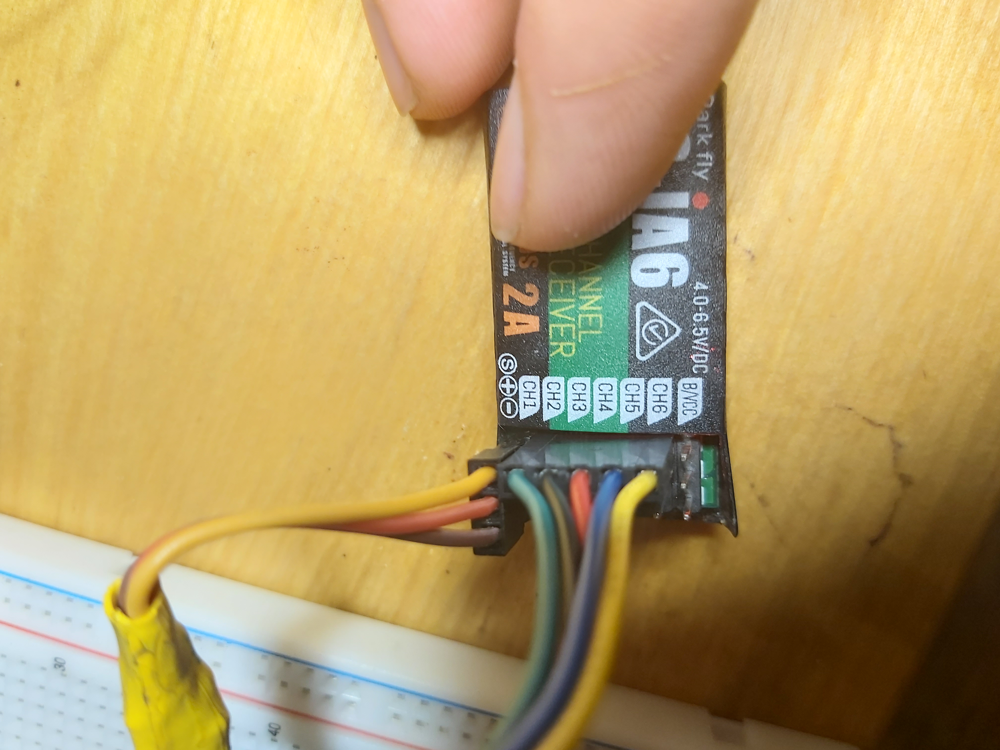
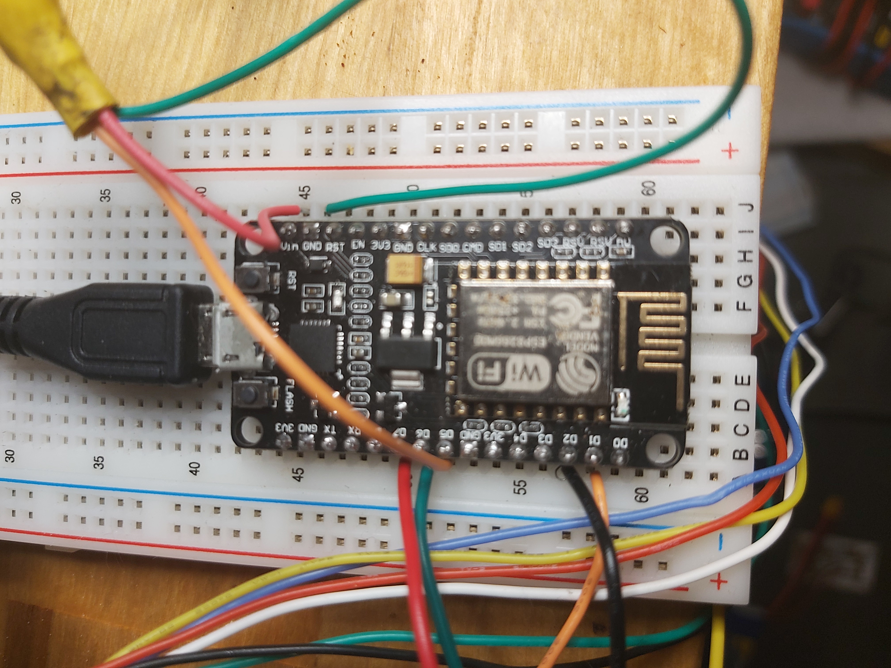
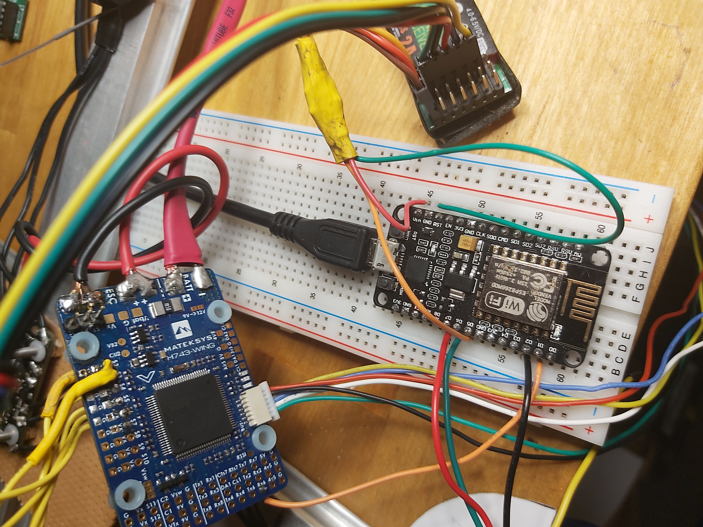

# ESP PWM To PPM Converter
### Modivation:
This was made out of necessity I got all new drone parts but the flight controllers
wanted a ppm signal (or sbus etc.)  The only recivers I had were old models with only pwm
outputs. So I wanted to make a pwm to ppm converter or at least an ppm output.

There is not alot out there on the topic so I figured the least I can do is share what I got working.
As well as some of the helpful resources. 

If you have any feedback or sudgestions let me know.

## Usage
Just upload to esp 8266 and hook up the same pins as I have in the pictures / in notes on ppm

REMEBER TO HAVE D4 UNPLUGGED ON UPLOAD AND BOOT or if you only need 4 pwm inputs change the top of the code to the following 
```c++
#define PWM_NUMBER 4 //change from 5 to 4
//and remove the 2
const unsigned int PWM_PINS[] = {14, 12, 13, 4};
```

I recomend Looking at the code since it is relitivaly simple and a great way to learn more I have tried to comment it where applicable

If your using this on another esp look up whitch pins support Interrupts you you can test by trial and error I recomend 
removing all pins but 1 or 2 known working one and going from there since if even one pin dosent work things will just break
the pwm inputs are also outputed to the usb serial port so you can see them from there


## My Setup







## Notes On PPM
I there are aslo ppm libraries such as [PulsePosition](https://github.com/PaulStoffregen/PulsePosition) and [PPMEncoder](https://github.com/schinken/PPMEncoder)
but I didnt have any luck getting them working on a esp. In the end [WifiPPM2](https://www.instructables.com/Wifi-PPM-no-App-Needed/) helped alot and this is based on that
with the wifi striped out. Huge thanks to  Andi23456 For his work on that.


## Notes On PWM

PWM Compatible pins that I have tested are:
```
//working 14, 12, 13, 4
//pin name d5, d6, d7, d2
//gpio 2 = d4  this pin must be disconected during bootup but if you plug it in affet it will boot
```

NodeMCU ESP8266-12E Limitations Mostly Effect GPIO
"
Based on my reading and experimentation, here is what I have learned about NodeMCU ESP8266-12E limitations with GPIO pins.

  -  The basic pins for digital input and output are D0..D8. These also support Arduino style pin interrupts, except for D0, which cannot support PWM either.
  -  D9 and D10, also labeled RX and TX on some boards, are also used for serial communications, including loading programs onto the device. I have read that if your program does not use serial communications, you can also use D9 and D10 as digital I/O. But, I have not been able to get this to work reliably.
  -  If you are using hardware Serial Peripheral Interface Bus (SPI) to communicate with peripherals, pins D5..D8 become unavailable, as they are used for hardware SPI. For example if you are using SPI with two peripherals, you tie up 8 pins: D5..D8 for the bus, two more pins for select, and two more pins for control.
  -  Some experimenters say that they have used GPIO9 and GPIO10 for input and output, respectively. But, not me.
  -  Also, remember that certain GPIO (0, 2 15) must be in specific states during boot and flash. Another limitation if you are not careful.
"
 
 Source: http://play.fallows.ca/wp/projects/electronics-projects/understanding-nodemcu-esp8266-12e-limitations/

[PWM Arduino Tutorial](https://www.benripley.com/diy/arduino/three-ways-to-read-a-pwm-signal-with-arduino/)


### Resorces And helpfull links
If this progect is not what you are looking for some of these maty help
[esp8266 Inturupt Tutorial and basic sample](https://circuits4you.com/2017/12/08/esp8266-external-interrupt-example/)

[Arduino MultiWii Library](https://github.com/fdivitto/MSP)

[ESP/ Arduino SBUS library](https://github.com/bolderflight/SBUS)